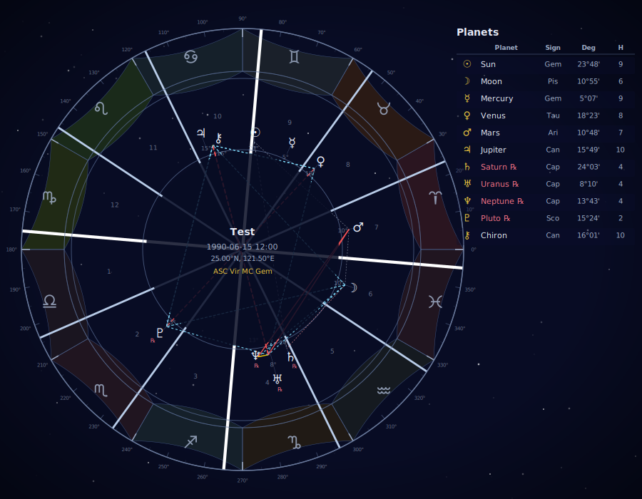
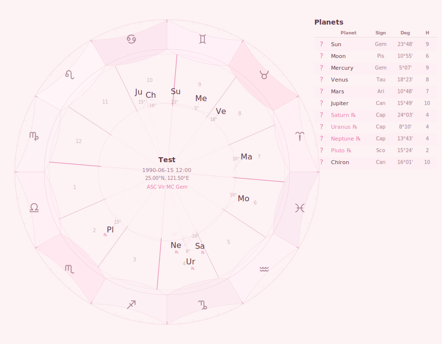
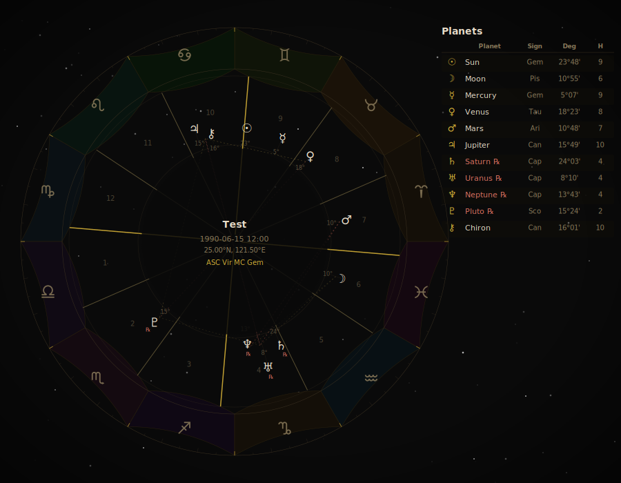

# Kerykeion Astrology API

> English summary — A production-grade FastAPI microservice that computes and renders professional astrology charts (birth charts, synastry, transits, composites, returns, moon phases) as structured JSON + themeable SVG. Built on NASA JPL ephemerides via Kerykeion / Swiss Ephemeris — the same astronomical data paid APIs like RapidAPI Astrologer charge for, here as a free, self-hosted alternative. Ships with API-key auth, per-endpoint rate limiting, structured logging, Docker / Render deployment, and CI. Serves as the chart engine behind a consumer-facing astrology product.

專業占星星盤 API：一個指令回傳「星盤資料 JSON + 主題化 SVG 圖」，天文資料來自 NASA JPL 星曆表，免費、可自架，取代 RapidAPI Astrologer 等付費服務。



## 問題 (The Problem)

占星類產品的星盤計算長期被付費 API 壟斷（RapidAPI Astrologer 按呼叫次數計費），而開源函式庫雖然算得準，產出的圖卻是工程師取向的預設樣式，無法直接放進面向消費者的產品。要自己做一個占星 App，得同時解決「天文計算的正確性」與「視覺設計的品牌感」兩件完全不同領域的事。

## 功能 (What It Does)

**星盤計算（對產品的價值：一套 API 涵蓋主流占星功能）**

- 本命盤（Birth Chart）、合盤（Synastry 關係相容性）、組合盤（Composite）
- 行運盤（Transit）、太陽回歸 / 月亮回歸（Solar & Lunar Return）
- 當下星盤（Now Chart，預設台北時區）與月相資料（月相名稱 + 照亮百分比）
- 每個端點同時回傳結構化 JSON（行星位置、宮位、相位）與完整 SVG 星盤圖

**視覺與品牌（對產品的價值：設計即 API 參數，前端零渲染成本）**

- 5 款自研主題：`light` / `dark` / `cosmic` / `sakura` / `gold`，每個請求用一個參數切換
- 雙渲染器：`kerykeion`（資訊完整、含相位表）與 `custom`（自研輕量渲染器，SVG 體積約為前者的 1/3–1/6，適合行動端與快速載入）
- `split_chart` 選項：輪盤與資料表分開回傳，讓前端自由排版

| Cosmic | Sakura | Gold |
|---|---|---|
|  |  |  |

## 產品決策 (Product Decisions)

- **為什麼自己寫第二個渲染器？** Kerykeion 內建渲染器資訊量大（約 216 KB SVG，含完整相位表），適合專業占星師，但視覺風格無法客製。自研渲染器（`custom_renderer.py`，純數學繪製、無前端依賴）把設計變成 API 的一部分：消費者產品可以用一個 `theme` 參數換整張圖的品牌風格，SVG 降到 33–77 KB。兩者並存，讓同一個 API 同時服務「專業模式」與「消費者模式」。
- **主題做在 API 層，而非前端。** 星盤圖的繪製邏輯（行星位置→角度→座標）與配色耦合很深，若丟給每個前端各自實作，等於每個客戶端都要重寫一次星象數學。把主題放進請求模型，前端只負責貼 SVG。
- **Auth 採「未設 `API_KEY` 即開放」的 dev mode。** 本地開發與試用零摩擦（clone 下來直接打 API），正式部署時 Render 會自動生成金鑰（`render.yaml` 的 `generateValue: true`）——安全預設不靠人記得設定。
- **Rate limit 依計算成本分級，而非一刀切。** 月相是純查表（60/min），本命盤要完整星曆計算（30/min），合盤/行運/組合盤要算兩個盤（20/min）。配額直接反映每個端點的真實成本結構。
- **天文資料選 NASA JPL 星曆（Swiss Ephemeris），不取近似公式。** 占星使用者會拿結果跟專業軟體對照，精度差 0.1 度就會被發現；這是「不能省」的核心品質，其他部分（如渲染器）才是可以取捨的地方。

## 技術棧 (Tech Stack)

| 層 | 技術 |
|---|---|
| 框架 | FastAPI + Pydantic v2（請求模型驗證） |
| 星象引擎 | Kerykeion ≥ 4.24（底層 Swiss Ephemeris / NASA JPL 星曆） |
| 渲染 | Kerykeion 內建 SVG + 自研 `custom_renderer.py`（純 Python 繪圖） |
| 安全 | API Key（`X-API-Key` header）、slowapi 分級 rate limiting、可設定 CORS |
| 可觀測性 | structlog JSON 結構化日誌 |
| 部署 | Docker、Render（`render.yaml` blueprint）、Python 3.11 |
| CI | GitHub Actions（語法檢查 + 啟動後 `/health` 冒煙測試） |

## 架構 (Architecture)

```
Client ──X-API-Key──> FastAPI (auth + rate limit + CORS)
                          │
              routers/ (charts, now)   ← 9 endpoints, 分級限流
                          │
              services/astrology.py    ← Subject 轉換、資料序列化
                          │
        ┌─────────────────┴──────────────────┐
   Kerykeion engine                    Renderer 層
   (Swiss Ephemeris / NASA JPL)   kerykeion (完整) / custom (輕量主題化)
                          │
              JSON chart_data + SVG chart  ──> Client
```

每個請求的流程：驗證金鑰 → 檢查限流 → 星曆計算（行星位置、宮位、相位）→ 依 `theme` / `renderer` 參數渲染 SVG → 回傳 `{chart: svg, chart_data: json}`。無資料庫、無狀態，水平擴充只需加 instance。

## 本地運行 (Run Locally)

```bash
# Python 3.11+
pip install -r requirements.txt

# 啟動（預設 port 8000，未設 API_KEY 時為開放的 dev mode）
python -m kerykeion_api.main

# 互動式 API 文件
open http://localhost:8000/docs
```

試打一月相 API：

```bash
curl http://localhost:8000/api/v1/now/moon-phase
```

**環境變數**

| 變數 | 預設 | 說明 |
|---|---|---|
| `API_KEY` | （空） | 設定後所有請求需帶 `X-API-Key` header；不設則為 dev mode |
| `CORS_ORIGINS` | `*` | 逗號分隔的允許來源 |
| `PORT` | `8000` | 伺服器埠號 |

**Docker**

```bash
docker build -t kerykeion-api .
docker run -p 8000:8000 -e API_KEY=your-key kerykeion-api
```

**部署**：repo 內含 `render.yaml`，可直接作為 Render blueprint 一鍵部署（API 金鑰自動生成）。

## 端點總覽 (Endpoints)

| Endpoint | 說明 | 限流 |
|---|---|---|
| `POST /api/v1/chart/birth-chart` | 本命盤 | 30/min |
| `POST /api/v1/chart/synastry` | 合盤（關係相容性） | 20/min |
| `POST /api/v1/chart/transit` | 行運盤 | 20/min |
| `POST /api/v1/chart/composite` | 組合盤 | 20/min |
| `POST /api/v1/chart/solar-return` | 太陽回歸 | 20/min |
| `POST /api/v1/chart/lunar-return` | 月亮回歸 | 20/min |
| `GET /api/v1/now/chart` | 當下星盤 | 30/min |
| `GET /api/v1/now/moon-phase` | 月相 + 照亮百分比 | 60/min |
| `GET /health` | 健康檢查 | — |

## 測試與 CI

GitHub Actions（`.github/workflows/ci.yml`）在每次 push / PR 時執行：

1. `python -m compileall kerykeion_api/` 語法檢查
2. 實際啟動 uvicorn 並 `curl /health` 做冒煙測試

## License

MIT
